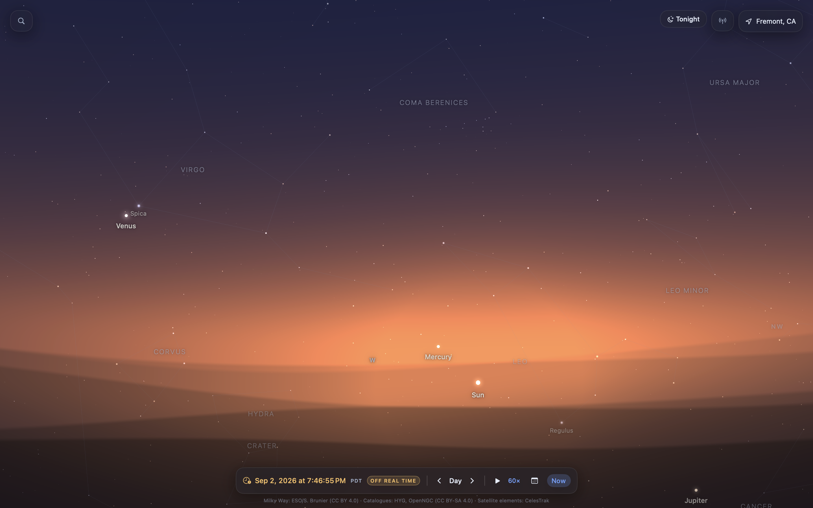
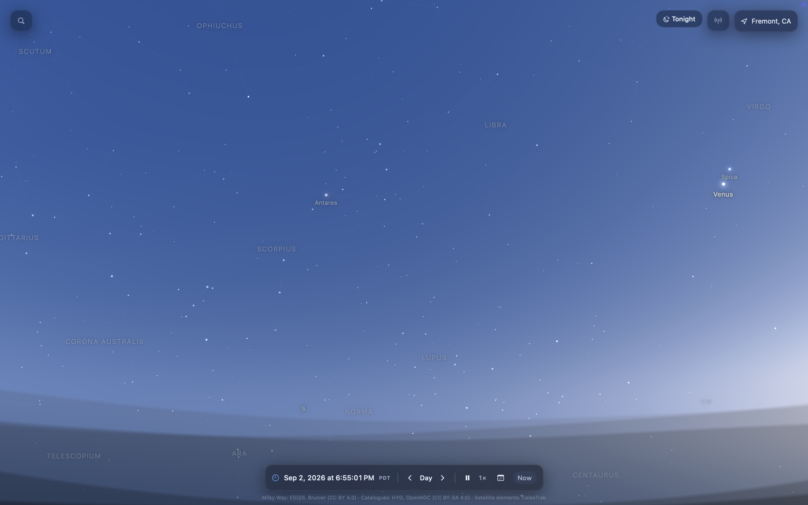

# Astronomy 🌌

A native macOS interactive planetarium built with **Swift, SwiftUI, and Metal**.

Astronomy renders a real-time view of the sky based on the user's **current location, date, and time**, allowing users to explore stars, planets, satellites, constellations, and other celestial objects through a fluid desktop interface.

The project began from my interest in creating a desktop astronomy experience inspired by apps such as Sky Guide, while building my own rendering engine, interaction system, astronomy calculations, and desktop-focused features from the ground up.

> **Status:** Active development

<p align="center">
  
  
</p>

---

## Overview

Astronomy is designed to make exploring the night sky feel immersive rather than like using a traditional star chart.

On launch, the application determines the user's current location and time and reconstructs the sky visible from that location.

For example, launching the app from Fremont, California displays the celestial sphere from Fremont at the current local time, with the sky continuously updating as time passes.

The application combines astronomical datasets, coordinate transformations, real-time simulation, GPU rendering, and native macOS interactions to create an explorable model of the sky.

---

## Current Features

### Real-Time Local Sky

The application automatically initializes using:

* Current geographic location
* Current date and time
* Local timezone
* Observer latitude and longitude

Celestial positions are recalculated relative to the observer so the rendered sky corresponds to what is actually visible from that location.

Location permission failures are handled gracefully, with support for manual location fallback.

---

### GPU-Accelerated Star Rendering

The sky renderer uses **Metal** rather than individual SwiftUI views for celestial objects.

The current star catalog contains approximately **83,000 stars**, derived from the HYG stellar database.

Star rendering takes into account properties such as:

* Apparent magnitude
* Stellar brightness
* Stellar color
* Camera field of view
* Current sky brightness

As the user zooms into the sky, progressively fainter stars become visible.

At wide fields of view, only brighter stars are shown. At narrower fields of view, the limiting magnitude increases and significantly deeper stellar fields become visible.

---

### Spatial Star Indexing

Rendering tens of thousands of stars every frame would be unnecessarily expensive.

The star catalog is therefore spatially partitioned into celestial regions that can be culled against the current camera viewport.

At narrow fields of view, only a small fraction of the complete catalog needs to be considered for rendering.

This significantly reduces per-frame astronomy calculations and keeps camera movement responsive.

---

### Dynamic Sky Lighting

The sky is not rendered using a fixed background color.

Its appearance changes according to astronomical conditions including:

* Sun altitude
* Observer location
* Local time
* Twilight state
* Viewing direction
* Distance from the Sun
* Camera field of view

The renderer transitions continuously between:

* Daylight
* Civil twilight
* Nautical twilight
* Astronomical twilight
* Night

Star visibility also responds to background sky brightness, allowing progressively more objects to appear as the sky becomes darker.

---

### Time Simulation

The simulation maintains a continuously advancing astronomical clock.

The rendering engine can calculate celestial positions for different points in time while keeping the UI clock independent from the high-frequency rendering loop.

This architecture is also being used as the foundation for a more complete **Time Machine** feature.

---

### Celestial Coordinate Engine

The application performs transformations between astronomical coordinate systems to render catalog objects from the perspective of the observer.

The transformation pipeline includes calculations involving:

* J2000 equatorial coordinates
* Precession
* Sidereal time
* Observer-relative horizontal coordinates
* Camera projection
* Screen-space coordinates

The projection pipeline has been optimized so repeated transformations can be composed into matrix operations rather than recalculating expensive trigonometric functions for every object every frame.

---

### Trackpad Navigation

The application is designed specifically for desktop exploration.

MacBook trackpad controls include:

* Two-finger sky navigation
* Natural-direction movement
* Momentum/inertia
* Pinch-to-zoom
* Smooth field-of-view transitions

The celestial sphere can be explored without requiring click-and-drag navigation.

---

### Solar System Objects

The application renders major Solar System bodies at their calculated positions.

Celestial bodies become increasingly prominent as the camera field of view narrows, creating a continuous transition between wide-field sky exploration and closer inspection.

---

### Satellite Tracking

The application also includes a satellite propagation and rendering system.

Satellite calculations run separately from the main rendering path to prevent propagation work from blocking the UI or Metal render loop.

Satellite positions are continuously updated and interpolated between propagation updates for smooth movement across the sky.

---

### Constellations and Labels

The sky includes contextual overlays for astronomical exploration, including:

* Constellation lines
* Constellation names
* Named stars
* Planet labels
* Other important celestial objects

Label placement is handled separately from the Metal renderer and includes prioritization and collision management to reduce visual clutter.

---

## Performance

One of the main engineering goals of Astronomy is maintaining fluid interaction while working with large astronomical datasets.

Current optimizations include:

* Metal-based rendering
* Spatial star catalog indexing
* View-frustum / celestial-cone culling
* Precomputed coordinate transformations
* Matrix-based projection
* Reusable Metal buffers
* Off-main-thread satellite propagation
* Background catalog loading
* Optimized label invalidation
* Frame-stage profiling

Instead of processing the entire stellar catalog every frame, the renderer attempts to perform work only for objects relevant to the current field of view.

---

## Technology

### Application

* **Swift**
* **SwiftUI**
* **SwiftData**
* **Core Location**

### Graphics

* **Metal**
* **MetalKit**
* **SIMD**

### Astronomy

* Celestial coordinate transformations
* Sidereal-time calculations
* Precession
* Observer-relative projections
* Solar System ephemeris calculations
* Satellite orbital propagation
* Magnitude-based visibility modeling

### Engineering

* Swift Concurrency
* XCTest / Swift Testing
* Git
* Xcode
* Performance profiling

---

## Architecture

The application separates astronomical calculations from rendering and interface code.

```text
Astronomy
│
├── Core
│   ├── Astronomy
│   ├── Coordinates
│   ├── Time
│   └── Models
│
├── Rendering
│   ├── Sky Renderer
│   ├── Camera
│   ├── Geometry
│   ├── Labels
│   └── Metal Shaders
│
├── Features
│   ├── Sky
│   ├── Search
│   ├── Time
│   └── Object Details
│
├── Data
│   ├── Star Catalogs
│   ├── Deep-Sky Catalogs
│   └── Satellite Data
│
└── Services
    ├── Location
    ├── Ephemeris
    └── Persistence
```

This separation allows the astronomy engine to evolve independently from the rendering system and makes future features easier to build without coupling them directly to the UI.

For additional implementation details, see [`ARCHITECTURE.md`](ARCHITECTURE.md).

---

## Data

Astronomy uses real astronomical datasets rather than procedurally generated star positions.

Current datasets include stellar, deep-sky, and orbital information from external astronomical catalogs.

The star catalog currently includes approximately **83,000 stars down to magnitude 9**.

Dataset sources, transformations, licenses, and attribution are documented in:

[`DATA_SOURCES.md`](DATA_SOURCES.md)

---

## Testing

Astronomical calculations are tested independently from the user interface.

Tests cover areas such as:

* Coordinate transformations
* Projection equivalence
* Precession
* Time simulation
* Sky visibility behavior
* Catalog indexing
* Satellite calculations
* Rendering-support mathematics

The goal is to keep visual experimentation separate from the mathematical correctness of the astronomy engine.

---

## Roadmap

Astronomy is actively being developed.

Planned features include:

### Observation Planner

Generate an observing itinerary based on location, time, object visibility, Moon conditions, and darkness.

### Object Paths

Visualize the path of planets, the Moon, satellites, and other moving objects across the sky.

### Time Machine

Scrub through hours, days, months, or years and watch the celestial sphere evolve.

### Compare Skies

Compare the sky between different locations or dates using synchronized views.

### Astrophotography Planner

Preview celestial framing based on telescope, focal length, and camera sensor specifications.

### Astronomy Journal

Save observations with their associated celestial conditions, location, and time.

### Orbit Lab

Move beyond the Earth-based sky view into an interactive 3D visualization of the Solar System.

See [`ROADMAP.md`](ROADMAP.md) for the larger development plan.

---

## Running the Project

### Requirements

* macOS
* Xcode
* Swift

Clone the repository:

```bash
git clone https://github.com/shubhi-stva/Astronomy.git
cd Astronomy
```

Open the Xcode project:

```bash
open Astronomy.xcodeproj
```

Then select the **Astronomy** macOS scheme and press **Run**.

The app may request location permission so it can initialize the planetarium using your current observer position.

---

## Motivation

I built Astronomy because I wanted to understand what goes into creating an interactive planetarium beyond the interface itself.

The project has given me the opportunity to work with:

* GPU rendering
* large astronomical datasets
* coordinate-system mathematics
* real-time simulation
* geospatial data
* performance optimization
* concurrency
* native macOS development

Rather than treating the sky as a static visualization, my goal is to build a system where astronomy data, time, location, and rendering continuously interact.

---

## Project Status

Astronomy is an ongoing personal project.

The core planetarium and rendering architecture are functional, while additional observing, simulation, and visualization tools are continuing to be developed.

---

## Attribution

Astronomy is an independent personal project.

Sky Guide by Fifth Star Labs served as visual and product inspiration for the general idea of an immersive planetarium experience. No proprietary Sky Guide source code, artwork, assets, or branding are used by this project.

Astronomical datasets retain their respective licenses and attribution requirements. See [`DATA_SOURCES.md`](DATA_SOURCES.md) for details.

---

## Author

**Shubhi Srivastava**

Software engineering student interested in graphics, simulation, data-intensive systems, and astronomy.

[GitHub](https://github.com/shubhi-stva)
